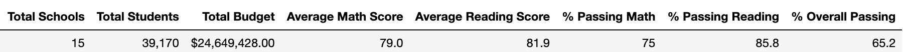
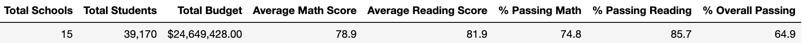
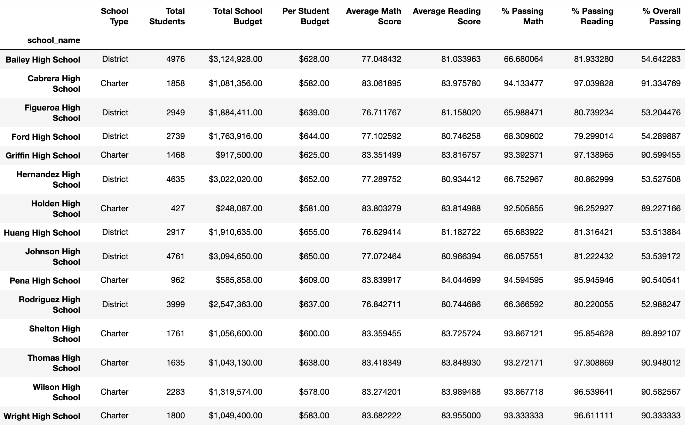
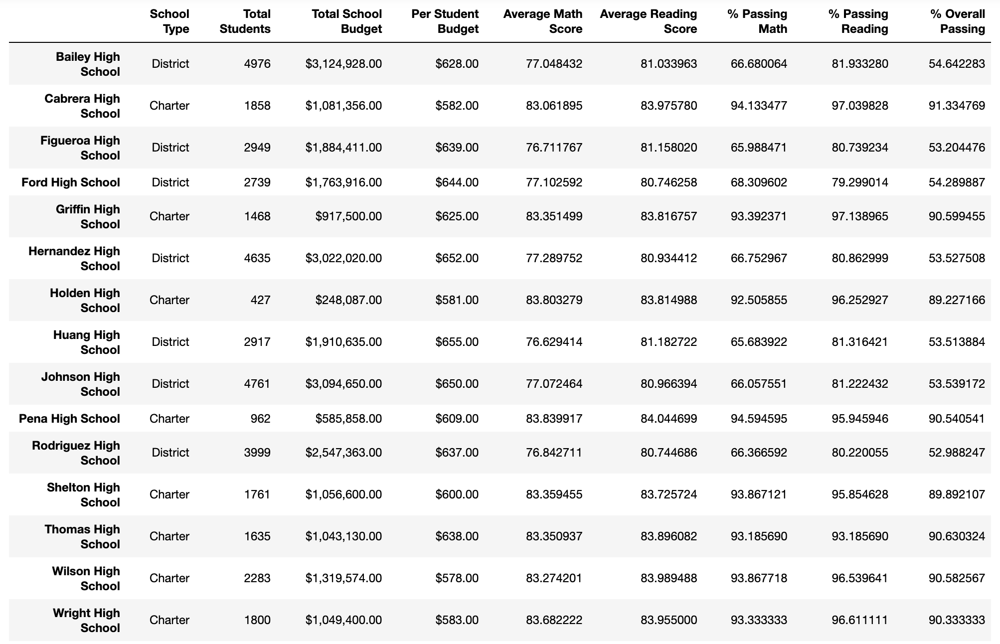
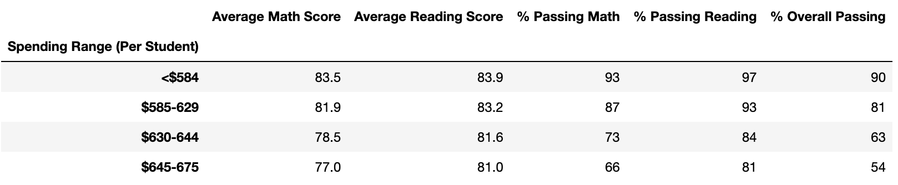
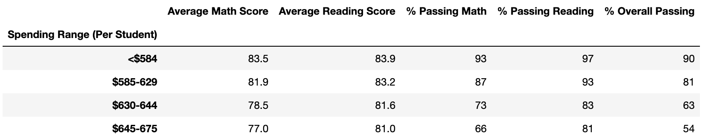
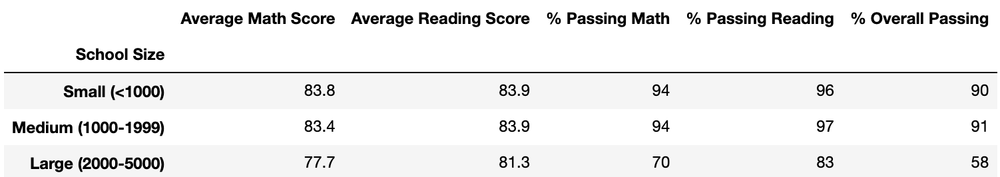
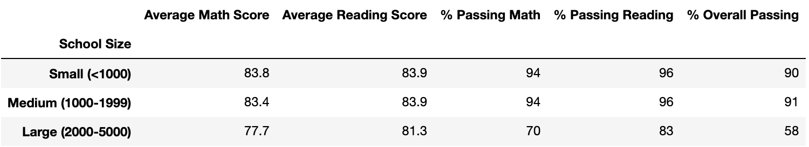
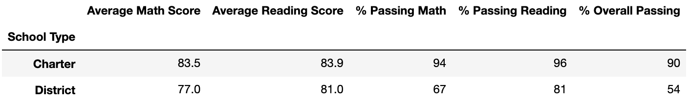

# School District Analysis

## Project Overview

The purpose of the project was to reanalyze the academic performance of students at the schools of a particular school district after reports of academic dishonesty (specifically, within the ninth grade of Thomas High School). An initial analysis was run on data including student math and reading scores, school budget sizes, and school types (charter or district). After removing all potentially affected student scores, a second analysis aimed to compare the new findings with those of the initial analysis.

## Results

- **District Summary:** The district summary was largely unaffected, with each score metric of the new analysis being within 0.3 points of the original analysis.

Original District Summary:

New District Summary:

- **School Summary:** The overall passing rankings of the schools remained unchanged. Thomas High School is still the second best performing school, though its overall passing percentage did drop about 0.3 points, from 90.95% to 90.63%.

Original School Summary:

New School Summary:

- **Thomas High School:** As just pointed out, Thomas High School's overall passing percentage dropped only 0.3 points. Likewise, its average math score, average reading score, and passing math percentage all remain about the same between analyses. Its passing reading percentage, however, fell over 4 points, from 97.3% to 93.2%.
- **Math and Reading Scores by Grade:** Since the removed scores only belonged to the ninth grade of Thomas High School, no other grades from the school or scores from any other school were affected.
- **Scores by School Spending:** The removed scores affected the passing reading percentage of schools in the $630-644 per student spending range. The percentage fell 1 point, from 84% to 83%.

Original Spending Summary:

New Spending Summary:

- **Scores by School Size:** Similarly to the spending summary, the removed scores brought the passing reading percentage of medium-sized schools down 1 point, from 97% to 96%.

Original Size Summary:

New Size Summary:

- **Scores by School Type:** Finally, the removed scores brought the passing reading percentage of charter schools down 1 point, from 97% to 96%

Original Type Summary:

New Type Summary:

## Summary

The removal of Thomas High School's ninth grade scores has affected the district analysis in a few ways:

- Thomas High School's passing reading percentage fell by 4.1 percentage points
- Thomas High School's overall passing percentage fell by 0.3 percentage points, which was not enough to change its performance ranking against other schools.
- Thomas High School's categorizations in data summaries (namely, schools with a $630-644 per student spending range, medium-sized schools, and charter schools) each suffered a single percentage point drop in their passing reading percentage.
- Math scores and passing math percentage remained about the same across the board.
